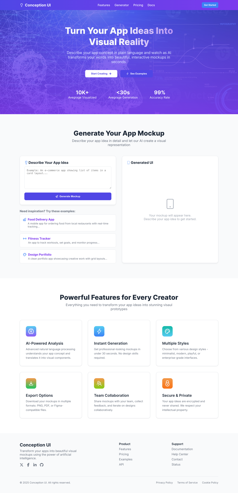

# 📌 Text-To-Design
Transform your **text inputs into dynamic designs** with this sleek React-based web app—built with **Vite**, styled via **custom CSS**, and enhanced with **react-icons**!



## 🚀 Overview

**Text to Design** is a modern frontend application that allows users, as well as developers during demos, to enter text and immediately see refined visual designs created from it. Powered by **React** and **Vite**, it provides an effortless development experience along with a polished user interface.

## 🛠️ Tech Stack

- ⚛️ **React JS** — Component-based UI  
- ⚡ **Vite** — Lightning-fast development & build tool  
- 🎨 **Custom CSS** — Full control over styling and layout  
- 🖼️ **react-icons** — Beautiful, scalable SVG icons


## 📦 Installation & Setup

Clone the repository and install dependencies: 

```
git clone https://github.com/your-username/text-to-design.git
cd text-to-design
npm install
```

## Run the development server:
```
npm run dev
```
Open your browser at the shown local address (e.g. http://localhost:5173)—the app will live-reload as you update files.

## Build for Production
```
npm run build
```

This creates an optimized build in the dist/ folder.


## ✨ Features

- ⚡ Blazing-fast bundling with Vite

- 🎨 Clean and responsive UI using custom CSS

- 🖼️ Scalable & crisp icons via react-icons

- ⚓ No tests or React hooks included—kept simple and maintainable


## 🙌 Contributing

Contributions are welcome! Whether it's design enhancements, bug fixes, or feature ideas, just fork the repo and send a pull request.


## 📄 License
This project is open source and licensed under the MIT License. See the LICENSE file for details.